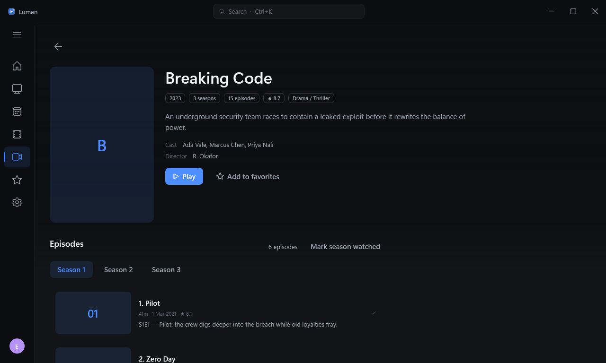

<div align="center">

# Lumen

**A premium IPTV client for Windows** — live TV, movies, and series from **Xtream Codes** accounts and **M3U / M3U8** playlists, with full **XMLTV** programme-guide support, wrapped in a dark, cinematic interface built to sit next to Netflix or Apple TV without feeling out of place.

<p align="center">
  <a href="https://github.com/Pimzino/lumen-iptv/releases/latest"></a>
  <a href="https://github.com/Pimzino/lumen-iptv/actions/workflows/ci.yml"></a>
  <a href="https://github.com/Pimzino/lumen-iptv/releases"></a>
  <a href="LICENSE"></a>
  
  
</p>


</div>

## Features

- **Xtream Codes & M3U** — connect a portal (server + username + password) or a playlist (URL or file); manage multiple profiles side by side.
- **Live TV** — a three-pane browser (categories → virtualized channel list with live now/next and progress → muted preview) that stays at 60fps with 10,000+ channels.
- **Programme guide** — a custom two-axis virtualized timeline (channels × time) with a red now-line, 30-minute gridlines, programme detail flyouts, jump-to-now, day picker, and category filter. Smooth with 500 channels across 7 days; correct across every timezone offset.
- **Movies & Series** — adaptive 2:3 poster grids, category sidebar, sort, and rich detail pages with backdrop, plot, metadata, seasons/episodes, and **resume from where you left off**.
- **The player** — edge-to-edge video (LibVLC), auto-hiding overlay, channel zapping with an info banner, quick channel list, audio/subtitle track pickers, aspect cycling, mini-player, and automatic reconnect with exponential backoff on stream drops.
- **Search** — global, debounced, across channels, VOD, and guide titles (Ctrl+K from anywhere).
- **Favorites & Home** — heart anything; Home greets you with a featured "Jump back in" resume card, then continue-watching, recently watched, favorite channels with live now/next, and recently added content.
- **Artwork that fills itself in** — when the provider ships no posters or backdrops, Lumen resolves them online (The Movie Database with your free key, keyless iTunes/TVMaze otherwise), caches every lookup in SQLite, and falls back to the guide's channel icons for logo-less channels. On by default; tunable under Settings → Artwork.
- **Native Windows 11 chrome** — Mica backdrop washed with the cinematic dark tint, rounded corners, dark DWM frame, Snap Layouts on the maximize button, and a Fluent content layer — all degrading gracefully on Windows 10.
- **The signature touch** — an *ambient glow*: the playing channel's dominant color, sampled and softly washed into the now-playing bar and zap banner.

## Screenshots

| Live TV | Guide |
|---|---|
|  |  |

| Movies | Movie detail |
|---|---|
|  |  |

| Series | Settings |
|---|---|
|  |  |

<sub>Screenshots are rendered by the app's own <code>--shot-shell</code> capture mode (an offscreen WPF render in <a href="src/Lumen.App/App.xaml.cs">App.xaml.cs</a>), not hand-taken.</sub>

## Download

Grab the latest build from the [**Releases**](https://github.com/Pimzino/lumen-iptv/releases/latest) page:

| Asset | What it is |
|---|---|
| **`Lumen-<version>-win-x64-setup.exe`** | Guided installer — Start-menu shortcut, optional desktop icon, clean uninstaller. |
| **`Lumen-<version>-win-x64-portable.zip`** | Portable build — unzip anywhere and run `Lumen.exe`. No install, nothing written to Program Files. |

Requires **64-bit Windows 10 (1809+) or Windows 11**. The build is self-contained — no separate .NET runtime install needed.

> [!NOTE]
> The executables are **unsigned**, so Windows SmartScreen may warn on first launch. Choose **More info → Run anyway**. (Removing that warning requires a paid code-signing certificate.)

## Build from source

Requires the **.NET 9 SDK** on Windows (the app targets `net8.0` / `net8.0-windows`; the SDK version is pinned in [`global.json`](global.json)).

```powershell
./build.ps1                 # restore, build (warnings as errors), run tests
./build.ps1 -IncludePerf    # also run the perf-gated tests
dotnet run --project src/Lumen.App

# Package a self-contained win-x64 build + installer (needs Inno Setup's iscc on PATH)
./build.ps1 -Package
```

Tagged releases are produced by the manual [`release.yml`](.github/workflows/release.yml) workflow (Actions → **Release** → **Run workflow**), which builds, packages the portable zip + installer, and publishes a GitHub Release with a commit changelog.

## Project layout

- `src/Lumen.App` — WPF application: views, styles, view models, composition root
- `src/Lumen.Core` — domain models and service abstractions (no UI, storage, or HTTP)
- `src/Lumen.Data` — SQLite storage, migrations, image cache, DPAPI credential protection
- `src/Lumen.Providers` — Xtream Codes / M3U / XMLTV clients and parsers
- `tests/` — xUnit test projects
- `tools/Lumen.DevServer` — a local Xtream/M3U/XMLTV fixture server for end-to-end testing

See [`ARCHITECTURE.md`](ARCHITECTURE.md) for the layering, threading model, and playback-handoff design, and [`DECISIONS.md`](DECISIONS.md) for the running log of choices made where the spec was silent.

## Storage & privacy

All state lives under `%LocalAppData%\Lumen` (SQLite database, logs, image cache). Xtream passwords are encrypted at rest with Windows DPAPI (current-user scope) and never written in plaintext.

## Contributing

Lumen isn't accepting code contributions at the moment — **pull requests will be closed unmerged.**

Bug reports and feature requests are very welcome, though:

- 🐛 **Found a bug?** [Open an issue](https://github.com/Pimzino/lumen-iptv/issues/new) with steps to reproduce, your Windows version, and a relevant snippet from `%LocalAppData%\Lumen\logs`.
- 💡 **Have a feature request?** [Open an issue](https://github.com/Pimzino/lumen-iptv/issues/new) describing what you'd like and why.

Please search [existing issues](https://github.com/Pimzino/lumen-iptv/issues) first to avoid duplicates.

## License

Lumen is released under the **[Apache License 2.0](LICENSE)** — you're free to use, modify, and redistribute it, provided you retain the original copyright and license notices (see [`LICENSE`](LICENSE) and [`NOTICE`](NOTICE)).

**Third-party components:** LibVLC (LGPL-2.1), CommunityToolkit.Mvvm (MIT), Serilog (Apache-2.0), Dapper (Apache-2.0), and Microsoft.Data.Sqlite (MIT).
