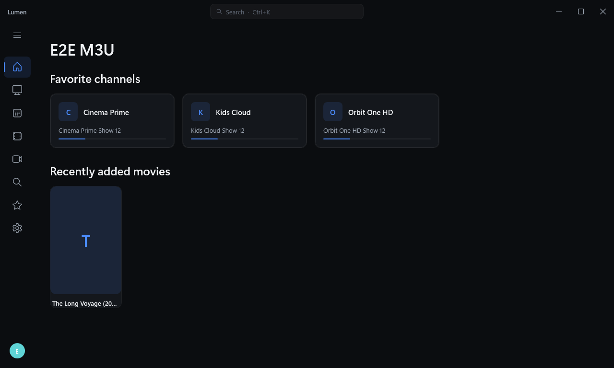
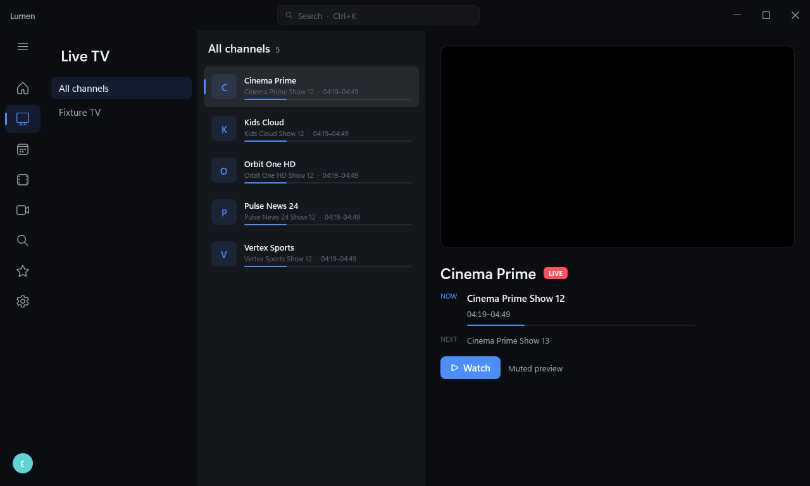
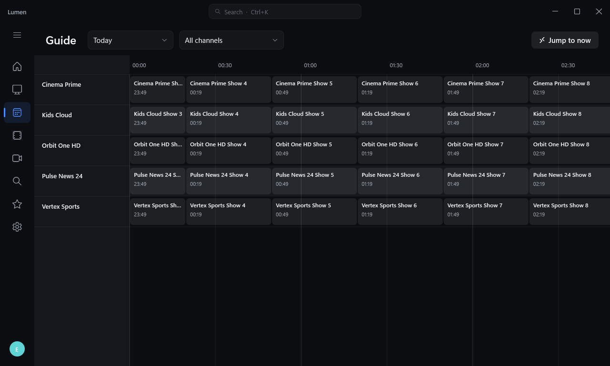
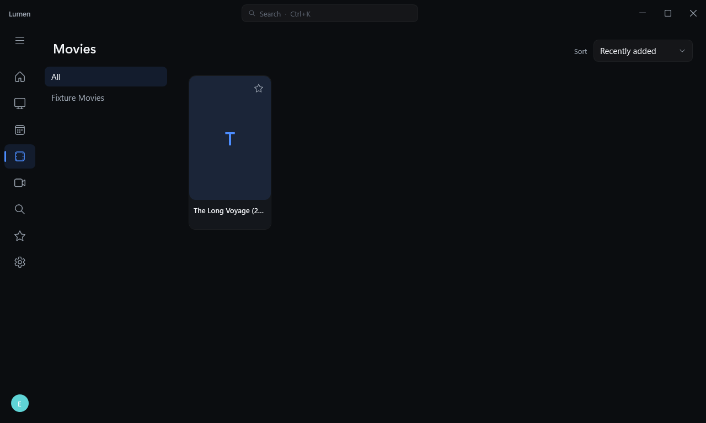
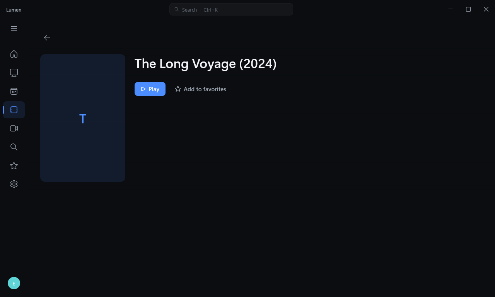
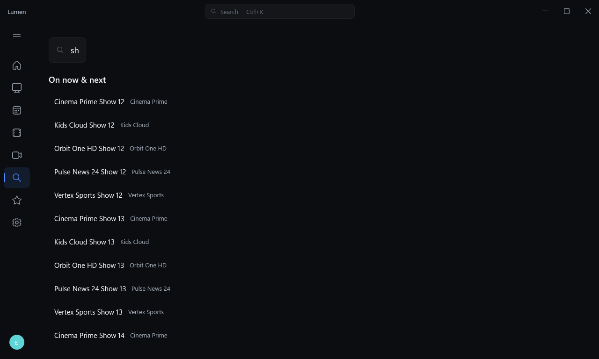
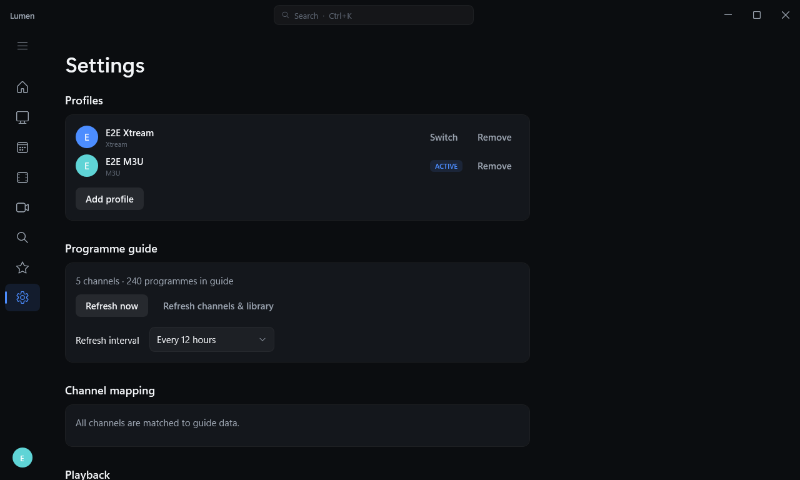

# Lumen

A premium IPTV client for Windows — live TV, movies, and series from **Xtream Codes** accounts and
**M3U / M3U8** playlists, with full **XMLTV** programme guide support, wrapped in a dark, cinematic
interface built to sit next to Netflix or Apple TV without feeling out of place.

<p align="center">
  
</p>

## Features

- **Xtream Codes & M3U** — connect a portal (server + username + password) or a playlist (URL or
  file); manage multiple profiles side by side.
- **Live TV** — a three-pane browser (categories → virtualized channel list with live now/next and
  progress → muted preview) that stays at 60fps with 10,000+ channels.
- **Programme guide** — a custom two-axis virtualized timeline (channels × time) with a red
  now-line, 30-minute gridlines, programme detail flyouts, jump-to-now, day picker, and category
  filter. Smooth with 500 channels across 7 days; correct across every timezone offset.
- **Movies & Series** — adaptive 2:3 poster grids, category sidebar, sort, and rich detail pages
  with backdrop, plot, metadata, seasons/episodes, and **resume from where you left off**.
- **The player** — edge-to-edge video (LibVLC), auto-hiding overlay, channel zapping with an
  info banner, quick channel list, audio/subtitle track pickers, aspect cycling, mini-player, and
  automatic reconnect with exponential backoff on stream drops.
- **Search** — global, debounced, across channels, VOD, and guide titles (Ctrl+K from anywhere).
- **Favorites & Home** — heart anything; Home surfaces continue-watching, favorite channels with
  live now/next, and recently added content.
- **The signature touch** — an *ambient glow*: the playing channel's dominant color, sampled and
  softly washed into the now-playing bar and zap banner.

## Screenshots

| Live TV | Guide |
|---|---|
|  |  |

| Movies | Detail |
|---|---|
|  |  |

| Search | Settings |
|---|---|
|  |  |

## Build & run

Requires the **.NET 9 SDK** on Windows (targets are `net8.0` / `net8.0-windows`).

```powershell
./build.ps1                 # Release build + tests
./build.ps1 -IncludePerf    # also run the perf-gated tests
dotnet run --project src/Lumen.App
```

## Package

```powershell
# Self-contained, single-file win-x64 build (managed assemblies bundled into Lumen.exe,
# LibVLC natives alongside). Output: artifacts/publish/win-x64/  (~183 MB)
dotnet publish src/Lumen.App -c Release -p:PublishProfile=win-x64

# Installer (requires Inno Setup's iscc on PATH). Output: artifacts/installer/
iscc build/Lumen.iss
```

The installer choice (Inno Setup over MSIX) is justified inline in `build/Lumen.iss`.

## Project layout

- `src/Lumen.App` — WPF application: views, styles, view models, composition root
- `src/Lumen.Core` — domain models and service abstractions (no UI, storage, or HTTP)
- `src/Lumen.Data` — SQLite storage, migrations, image cache, DPAPI credential protection
- `src/Lumen.Providers` — Xtream Codes / M3U / XMLTV clients and parsers
- `tests/` — xUnit test projects (198 tests)
- `tools/Lumen.DevServer` — a local Xtream/M3U/XMLTV fixture server for end-to-end testing

See **`ARCHITECTURE.md`** for the layering, threading model, and playback-handoff design, and
**`DECISIONS.md`** for the running log of choices made where the spec was silent.

## Storage & privacy

All state lives under `%LocalAppData%\Lumen` (SQLite database, logs, image cache). Xtream
passwords are encrypted at rest with Windows DPAPI (current-user scope) and never written in
plaintext.

## Non-goals (v1)

Catch-up/timeshift recording, DLNA/casting, light theme, multi-window, non-Windows platforms, and
a parental PIN (stubbed as "coming soon") are intentionally out of scope for this release.

## Licenses

Built with LibVLC (LGPL-2.1), CommunityToolkit.Mvvm (MIT), Serilog (Apache-2.0), Dapper
(Apache-2.0), and Microsoft.Data.Sqlite (MIT).
